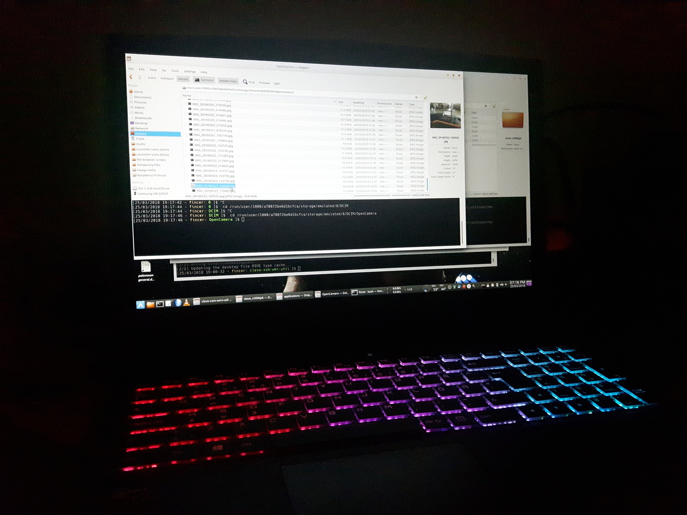

# Clevo N950TP6

Various instructions for setting up (Arch) Linux OS on Clevo N950TP6

[Clevo website](https://www.clevo.com.tw)

## Table of Contents

----------------

### Good to know

- Laptop bought from [Clevo Computer](https://clevo-computer.com/) (old link: `http://clevo-systems.com/`, Clevo Systems). Fast shipping and candies included (Europe). Recommended!

- Came with Windows 10 preinstalled on NVMe SSD (Samsung EVO 960) although I set `No OS` on their website.

- If you had Windows 10 preinstalled, back it up - create a complete backup of your new NVMe SSD. Just in case. I used `dd`

- You need Grub/Syslinux boot parameters `acpi_osi="!Windows 2015" acpi_osi=Linux` in order to access Linux desktop environment as recent Linux OSes tend to freeze on this laptop while loading DE. This rule applies to Live USB/CDs as well.

- You need a recent Linux kernel (4.14 >) for this laptop

- After proper configuration, everything works as expected. Recommended for Linux usage if you can deal with Nvidia Optimus

- If you don't use UEFI (read: you use traditional HDD instead of fast NVMe SSD), you need to disable `UEFI boot` option in [UEFI/BIOS menu](images/bios/bios_4.jpg). You can re-enable it if you [decided to use UEFI boot](ssd_hdd_uefi/README.md)

----------------

### [UEFI // SSD + HDD configuration, Linux installation](ssd_hdd_uefi/README.md)

- **What? :** A sample configuration instructions for setting up UEFI and NVMe SSD + HDD on Clevo N950TP6 (Linux)

----------------

### [CPU Thermal Control Configuration](cpu_thermal_control/README.md)

- **What? :** Set a maximum temperature limit for your CPU (intel i7-8700)

    - [Files](cpu_thermal_control)

    - [PKGBUILD for Arch Linux](cpu_thermal_control/PKGBUILD)

----------------

### [Keyboard Backlight & Color Support](keyboard_color_support/README.md)

- **What? :** Control laptop keyboard backlight & colors, patched for Clevo N950 TP6 (tested and works!)

    - [Files](keyboard_color_support)

        - [clevo-xsm-wmi-dkms - PKGBUILD for Arch Linux](keyboard_color_support/clevo-xsm-wmi-dkms/PKGBUILD)

        - [clevo-xsm-wmi-util - PKGBUILD for Arch Linux](keyboard_color_support/clevo-xsm-wmi-util/PKGBUILD)

----------------

### [Multi-monitor support](multimonitor_and_desktop/xf86-intel-multimonitor/README.md)

- **What? :** Enable multi-monitor support for your Clevo N950TP6 laptop (Linux)

    - [Files](multimonitor_and_desktop/xf86-intel-multimonitor)

        - [xf86-intel-multimonitor - PKGBUILD for Arch Linux](multimonitor_and_desktop/xf86-intel-multimonitor/PKGBUILD)

----------------

### [Laptop Images](images)

- **What? :** Sample images of Clevo N950TP6 laptop

    - [BIOS/UEFI screens](images/bios)

    - [Linux images](images/linux-run)

    - [General laptop images (enclosure etc.)](images)

    - [Physical interfaces/connections](images/inputs)

----------------

## Something missing?

If you feel some relevant information is missing or not well explained, please open a new issue on [Github issue tracker](https://github.com/Fincer/clevo_n950tp6/issues). Thank you!
